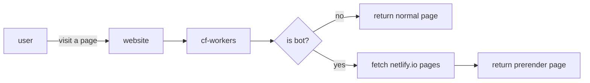

# Background

For now, only Netlify support Prerendering. While waiting for Cloudflare Pages to support that also, this script aims to give the same result by fetch netlify through workers. Netlify is also using a forked version prerender on their end https://github.com/netlify/prerender.

## How it works

When a user visits on specified routes, cf-workers will check the user_agent:

> **Note** >  Sometimes take 2-20s to get the first prerender page. Meanwhile on cached version is faster.
