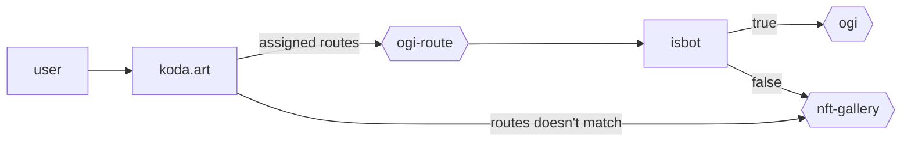

## Background

Currently, our DAPP is rendered using Client-Side Rendering (CSR). The downside of CSR is that it is quite difficult to optimise for SEO stuff, including OpenGraph, compared to Server-Side Rendering (SSR).

This service can help to achieve that. So, our DAPP looks better regarding SEO (Google search results) or when we share our link on social media.

Services:

- [ogi-route](https://github.com/kodadot/workers/tree/main/services/ogi-route). Act as a load balancer to proxy user agent to render ogi or nft-gallery.
- [ogi](https://github.com/kodadot/workers/tree/main/ogi). It acts as a mini SSR page to render meta tags.
- [nft-gallery](https://github.com/kodadot/nft-gallery). Our DAPP

Third-party similar services:

- https://prerender.io/
- https://ostr.io/

Better alternative implementation:

- Append meta tags to the HTML response from the server.
- Even Better: Use SSR. Ref: https://github.com/kodadot/nft-gallery/pull/9155 (but, so many breaking changes)

## Architecture diagram

